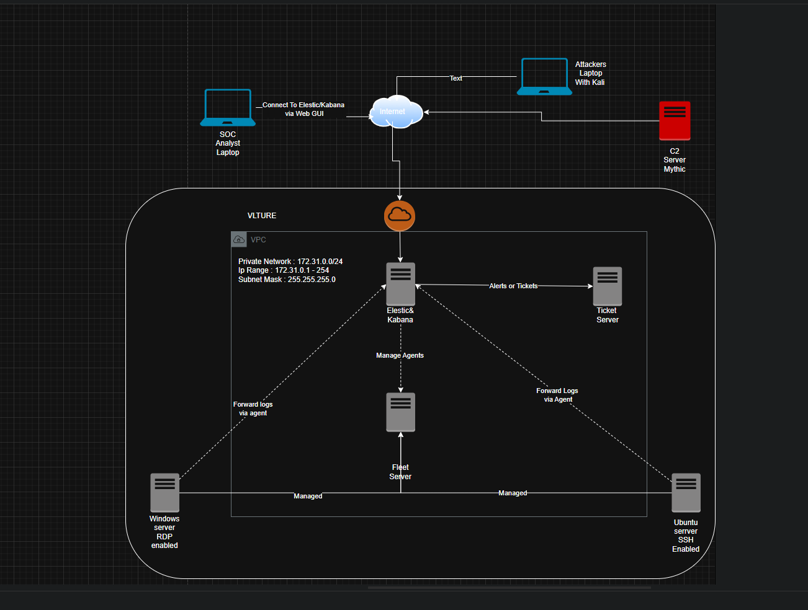

# 🔐 ELK Stack SOC Automation Project


A full end-to-end **Security Operations Center (SOC)** home lab deployed on **Vultr Cloud**, integrating SIEM capabilities with Endpoint Detection & Response (EDR) and an automated ticketing pipeline to detect and respond to real-world attack simulations.

---

## 🎯 Objectives

- Deploy a full **ELK Stack** (Elasticsearch, Logstash, Kibana, Fleet Server)
- Configure endpoint telemetry using **Elastic Agent** and **Sysmon** on Windows and Ubuntu
- Engineer custom **detection rules** for Brute Force (SSH/RDP) and Command & Control (C2) traffic
- Integrate **osTicket** to automate the Alert → Incident Ticket lifecycle
- Simulate adversary techniques and validate the full SOC analyst workflow

---

## 🏗️ Architecture

[](digrams/Logical-Digram.png)

| Component | Details |
|---|---|
| **SIEM Server** | Ubuntu 24.04 — Elastic Stack (Elasticsearch + Kibana) |
| **Fleet Server** | Ubuntu 24.04 — Centralized Elastic Agent management |
| **Windows Target** | Windows Server 2022 — Sysmon + Elastic Agent |
| **Linux Target** | Ubuntu Server — Elastic Agent |
| **Attack Platform** | Ubuntu 24.04 — Mythic C2 Framework |
| **Case Management** | Ubuntu 24.04 — osTicket (API/Webhook integration) |

---

## 🚀 Implementation Phases

### Phase 1 — Infrastructure & SIEM Setup (Days 1–7)
Provisioned cloud VMs on Vultr for the SIEM and all endpoints. Configured Elasticsearch for data storage, Kibana for visualization, and established a Fleet Server for centralized agent management.

### Phase 2 — Telemetry & Log Ingestion (Days 8–13)
Deployed Sysmon on Windows targets for granular event logging (process creation, network connections). Installed Elastic Agents on all endpoints and normalized incoming data using the Elastic Common Schema (ECS).

### Phase 3 — Detection Engineering & Alerting (Days 14–22)
Built custom KQL (Kibana Query Language) detection rules for:
- Successful and failed **RDP Brute Force** attempts
- **SSH authentication failures**
- **Mythic C2** agent check-ins and beaconing

Created a unified SOC Dashboard to visualize global login attempts and system health in real time.

### Phase 4 — Incident Response & Ticketing (Days 23–30)
Configured osTicket to receive alerts from Elastic via webhook. Conducted full adversary simulations (SSH/RDP Brute Force, C2 deployment) and documented the complete **Alert → Ticket → Resolution** lifecycle, simulating a professional SOC analyst workflow.

---

## 📊 Attack Simulations & Detections

| Attack Type | Detection Method | Response Action |
|---|---|---|
| RDP Brute Force | Threshold alert (>10 failed logins/min) | Source IP identified, osTicket #102 created |
| SSH Brute Force | Failed auth spike detection | Alert triggered, IP correlated across logs |
| C2 Communication | Mythic agent heartbeat pattern detection | Process terminated, full log analysis conducted |

---

## 🛠️ Tools & Technologies

| Category | Tool |
|---|---|
| SIEM | Elastic Stack (Elasticsearch, Kibana, Fleet) |
| EDR & Logging | Elastic Agent, Sysmon |
| Ticketing / Case Mgmt | osTicket |
| Adversary Simulation | Mythic C2 Framework |
| Cloud / VMs | Vultr |
| OS Targets | Windows Server 2022, Ubuntu 24.04 |

---

## 📁 Repository Structure
```
├── diagrams/         # Architecture and logical diagrams
├── documentation/    # Step-by-step setup notes and phase writeups
├── scripts/          # Automation and configuration scripts
├── screenshots/      # Screenshots for Projects
└── README.md
```

---

## 📚 Key Skills Demonstrated

- SIEM deployment and configuration
- Detection rule engineering with KQL
- Endpoint telemetry collection and log normalization
- Adversary simulation and threat hunting
- Automated incident response pipeline design
- Cloud infrastructure provisioning

---

## 📄 License

This project is licensed under the [MIT License](LICENSE).
